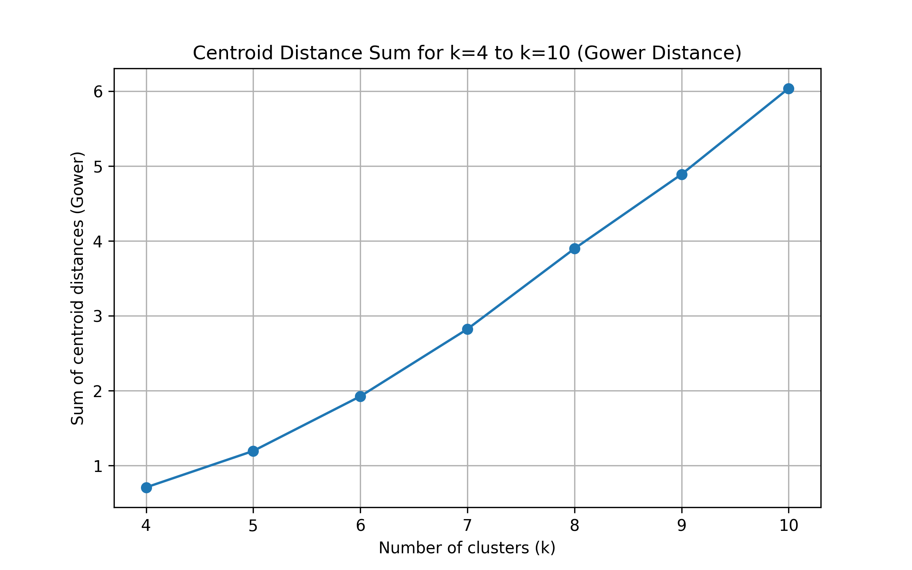

# 📌 Customer Segmentation using Custom K-Means (Gower Distance)

This project implements a **custom K-Means clustering algorithm** using **Gower distance** instead of Euclidean distance.  
The goal is to cluster credit card customers into meaningful groups based on their financial behavior and transaction patterns.

> ✅ **Key Point:** Standard `sklearn` K-Means cannot be used because it only supports **Euclidean distance**.  
> In this project, we built our own K-Means using **Gower distance**.

---

## 📂 Dataset

- **Name:** CC GENERAL Dataset
- **File:** `data/CC GENERAL.csv`
- **Samples:** 8950 customers
- **Features:** 18 (17 used after removing customer ID)

The dataset contains variables such as balance, purchases, cash advances, payment behaviors, and credit limits.

---

## ✅ Project Workflow (Steps)

### **Step 1: Data Preprocessing**
✔ Remove `CUST_ID` (identifier column)  
✔ Fill missing numeric values with **mean imputation**  
✔ Normalize all features using **Min-Max scaling** (range [0,1])  
✔ Save cleaned dataset:  
`data/CC_GENERAL_clean_scaled.csv`

---

### **Step 2: Gower Distance**
Since all features are numeric and scaled to [0,1], the **Gower distance** between two customers \(x\) and \(y\) is:

\[
Gower(x,y) = \frac{1}{p} \sum_{i=1}^{p} |x_i - y_i|
\]

✅ Validation test on the first two customers:

**Gower(row0, row1) = 0.0803678613**

---

### **Step 3: Custom K-Means using Gower Distance**
A custom K-Means algorithm was implemented with:
- Random centroid initialization
- Cluster assignment based on **Gower distance**
- Centroid update using mean of each cluster
- Stop condition: convergence or max iterations

---

### **Step 4: Run clustering for k = 4 to 10**
For each value of k, we computed:

✅ **Sum of Gower distances between all centroid pairs**  
(This is the required metric for the project.)

Results are saved in:  
`report/centroid_distance_results.csv`

---

### **Step 5: Visualization**
A plot was generated to show how centroid separation changes as k increases:

✅ `report/centroid_distance_plot.png`

---

## 🧾 Final Results

| k  | Sum of centroid distances (Gower) |
|----|-----------------------------------|
| 4  | 0.709048 |
| 5  | 1.195053 |
| 6  | 1.925172 |
| 7  | 2.823604 |
| 8  | 3.898224 |
| 9  | 4.891282 |
| 10 | 6.038821 |

---

## 📈 Plot

Below is the centroid distance sum trend for k=4..10:



---

## 🗂️ Project Structure

```text
PhD_Project_KMeans/
│── data/
│    ├── CC GENERAL.csv
│    ├── CC_GENERAL_clean_scaled.csv
│
│── report/
│    ├── centroid_distance_results.csv
│    ├── centroid_distance_plot.png
│    ├── KMeans_Gower_StepByStep_With_Analysis.docx
│    ├── Project2_KMeans_Gower_Full_Report.docx
│
│── src/
│    ├── main.py
│    ├── plot_results.py
│
│── requirements.txt
│── README.md
│── .gitignore
